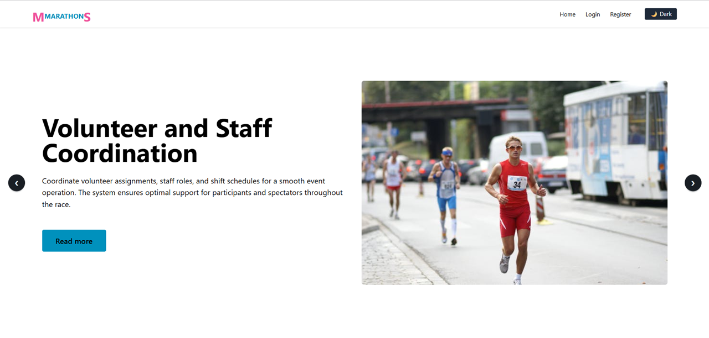

🏃 Marathon Management System
Welcome to the Marathon Management System — a responsive web application built to simplify the organization and participation experience of marathon events. Whether you're an event organizer, a runner, or a volunteer, this platform empowers you to manage marathons efficiently from start to finish.

🔗 Live Website: https://assign11-marathon.web.app/

✨ Features
* ✅ User Authentication & Authorization
* Secure login system powered by Firebase.
* Role-based access control for organizers, runners, and admins.

🌓 Dark/Light Theme Toggle
* Real-time switch between dark and light modes using daisyUI.

📱 Fully Responsive Design
* Seamless experience across devices using Tailwind CSS.

📋 Dynamic Marathon Event Management
* Create, edit, and manage marathon events and race details.
* Runners can register for events, view their profiles, and check results.

* 🛰️ Real-Time Race Progress Tracking (New Feature)
* Live GPS-based progress tracking for runners using integrated APIs.
* Organizers and viewers can follow participants' progress in real-time.

🎯 Enhanced UX with Modern Tools
* Real-time alerts and feedback using sweetalert2.
* Clean interface with react-icons.
* Carousels and announcements using swiper.js.

🛠️ Built With
* React
* React Router DOM
* Firebase Auth
* Axios
* MongoDB (via backend API)
* Tailwind CSS + DaisyUI
* Mamba UI Component
* SweetAlert2
* React Icons
* Dark/Light Theme Toggle

🔐 Security
* Sensitive credentials managed with environment variables.
* User roles ensure only authorized actions for each account type.

📱 Responsive Views
* Tested and optimized for:
📱 Mobile
💻 Desktop
📲 Tablets